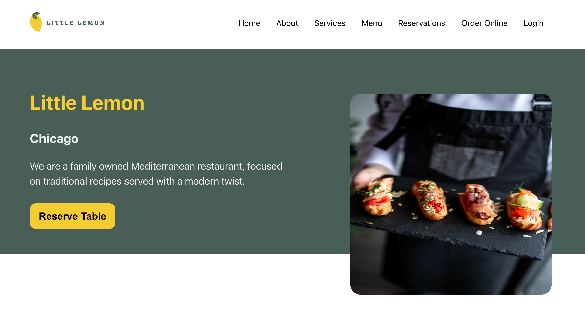
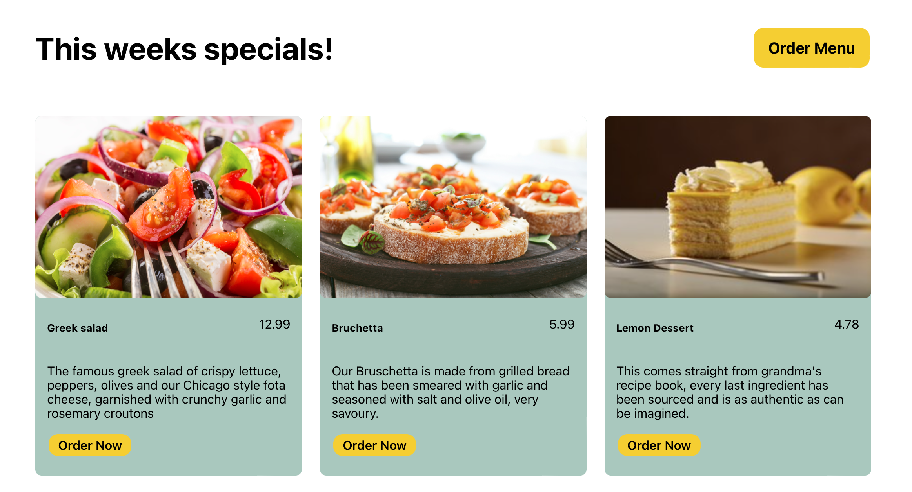
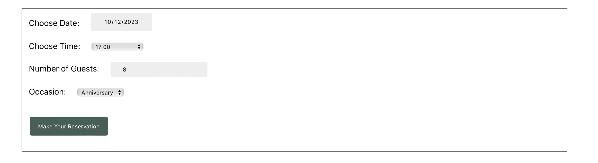
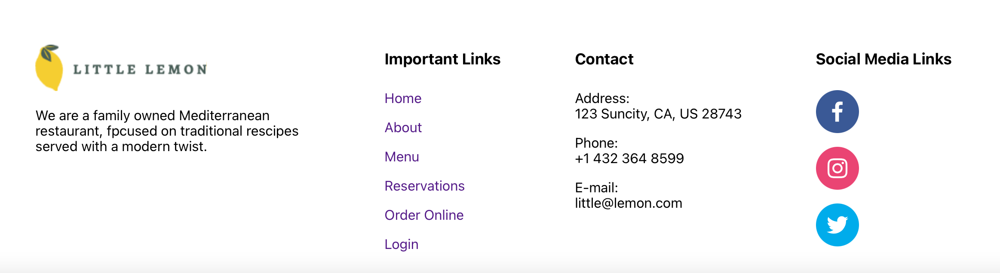

### Welcome to the Capstone Project for Meta front-end developer certification.

The Capstone project entails the Little Lemon restaurant design for a reservation function using React, HMTL, and CSS. 

Here is a snap shot of the Little lemon assignment.
### The Homepage with Navigations

### Reserving a table function

